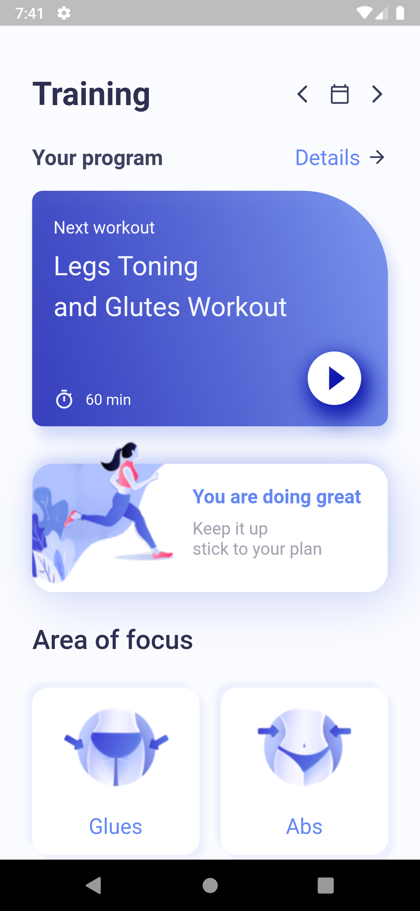
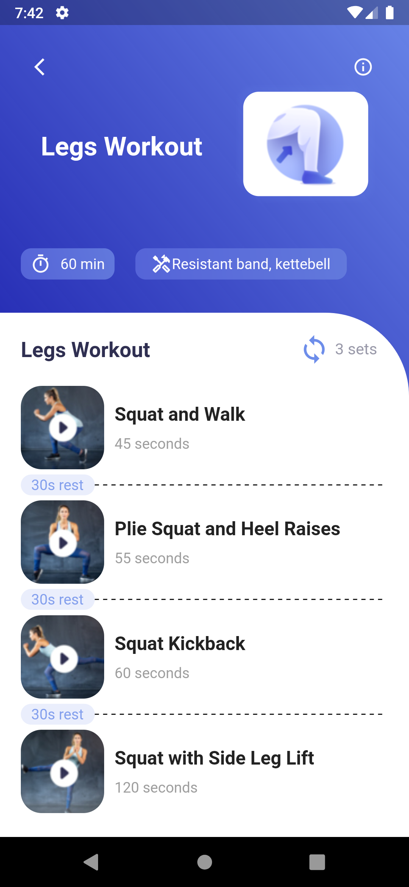

# Flutter_Workout_App
This is a app to help workout at home. App has video player functionality. Videos is hosted on youtube.

<a href="https://github.com/FahimKamal/Flutter_Workout_App/raw/main/workout_app/Workout_app-release.apk" download="FILENAME">Download and tryout the app</a>

</img>

<strong>Fig 1: Home Screen.</strong>

  

</img>

<strong>Fig 2: Home Screen.</strong>

  

</img>

<strong>Fig 3: Video player page.</strong>

  
